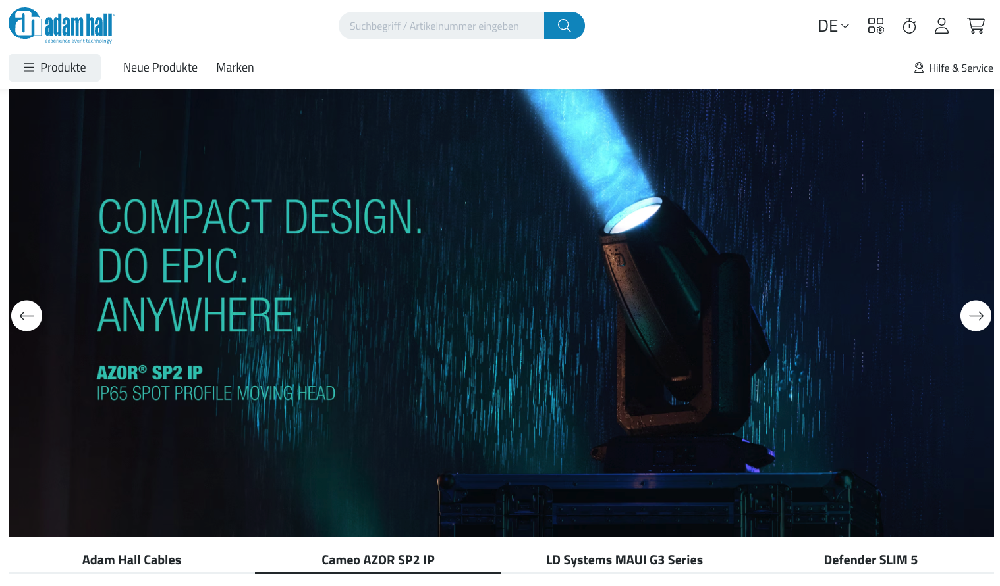
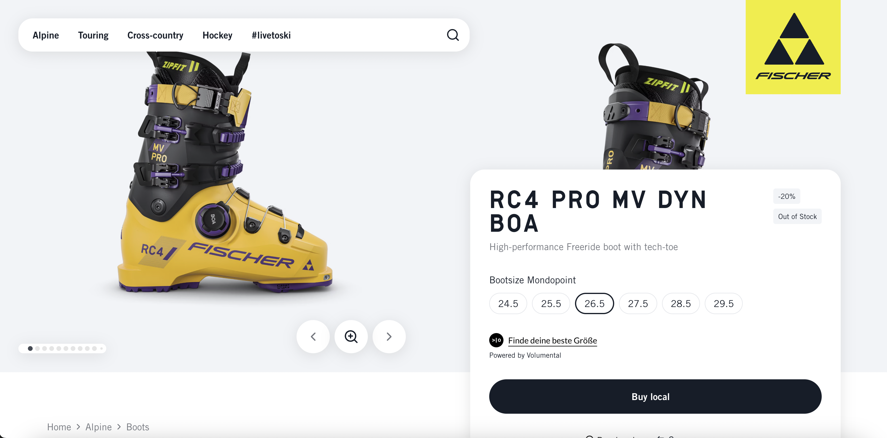
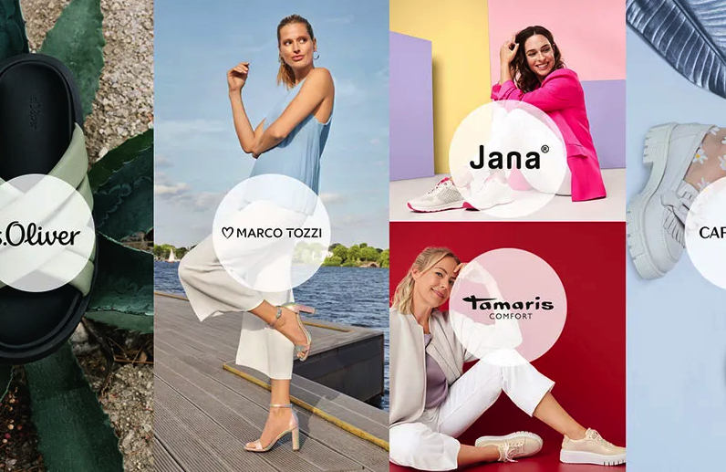
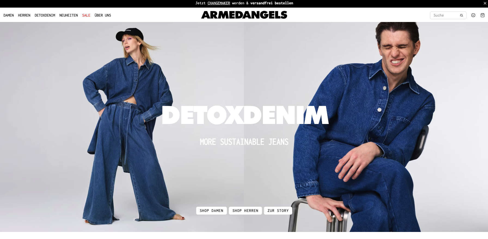
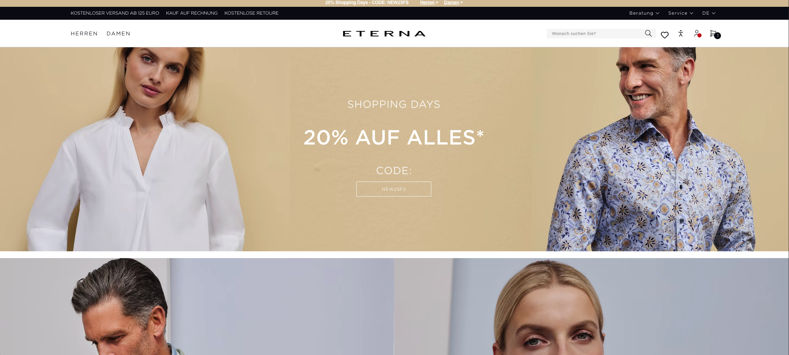
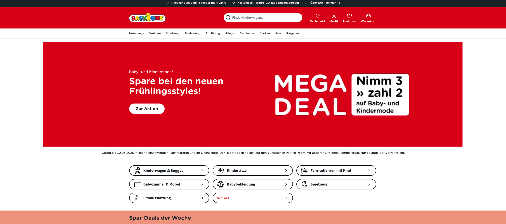

## Portfolio

---

#### Table of Contents:
- [Vue 3 & Nuxt](#vue-3-nuxt-headless-ssr-typescript-tailwind)
- [Vue 2](#shopware-6-vue-23-twig-javascript)
- [React & Next](#react--next)
- [Python](#python)

---

### Vue 3, Nuxt, Headless, SSR, Typescript, Tailwind

- **[Adam Hall](/portfolio/projects/adamhall)**
- **[Wortmann](/portfolio/projects/wortmann)**
- **[Fishersports](/portfolio/projects/fishersports)**

|                                       |                                           |                                       |
|---------------------------------------|-------------------------------------------|---------------------------------------|
|  |  |  |

---

### Shopware 6, Vue 2/3, Twig, Javascript

- **[Armedangels](/portfolio/projects/armedangels)**
- **[Eterna](/portfolio/projects/eterna)**
- **[Babyone](/portfolio/projects/babyone)**
- [Melitta](https://www.melitta.de){:target="_blank"}
- [Air Wolf](https://www.air-wolf.de){:target="_blank"}
- [Poggenpohl](https://www.poggenpohl.com/de){:target="_blank"}

|                                          |                                     |                                      |
|------------------------------------------|-------------------------------------|--------------------------------------|
|  |  |  |

### React & Next
> Hands-on apps showcasing core concepts: Hooks, Nuxt, Tanstack, React Query, Server components, Form actions, SSR, State management(Redux, Zustand) and performance optimization.
> Continuously staying aligned with React 16-19 updates.

- **[HealthcareTA](/portfolio/projects/healthcare)**
- **[ExpenseTracker](/portfolio/projects/expensetracker)**
- **[NextFood](/portfolio/projects/nextfood)**
- **[TanEvents](/portfolio/projects/tanevents)**
- **[Placepicker](/portfolio/projects/placepicker)**
- **[Feedback](/portfolio/projects/feedback)**
- **[Countdown](/portfolio/projects/countdown)**
- **[Food](/portfolio/projects/food)**
- **[Context](/portfolio/projects/context)**
- **[ReStore](/portfolio/projects/restore)**

---

### Python
> Completed [basic projects](https://www.udemy.com/course/100-days-of-code) with Pandas, Beautiful Soup, Request, Flask, Pandas, NumPy, Scikit Learn, Plotly, and Matplotlib. Now ~~building up portfolio~~ having fun.
- **[HealthcareTA](/portfolio/projects/healthcare)**
- **[JobScraper](/portfolio/projects/jobscraper)**
- **[JobDash](/portfolio/projects/jobdash)**
- **[MovieData](/portfolio/projects/moviedata)**