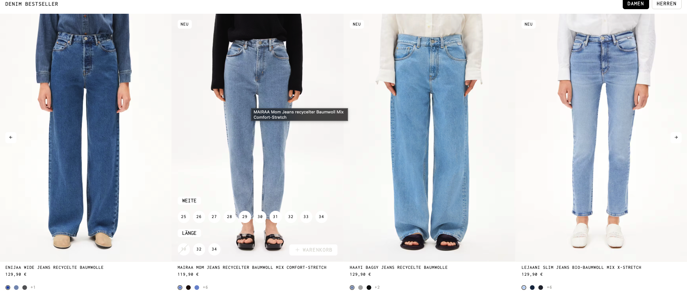
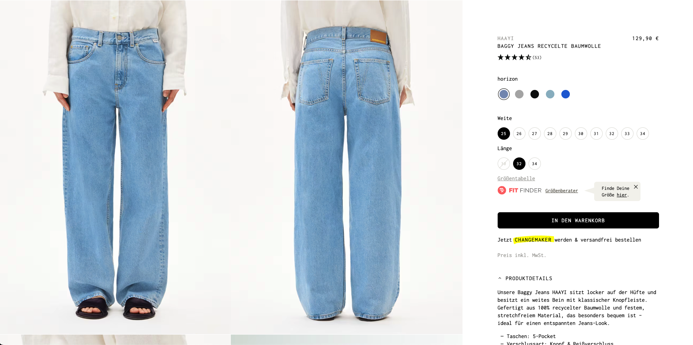
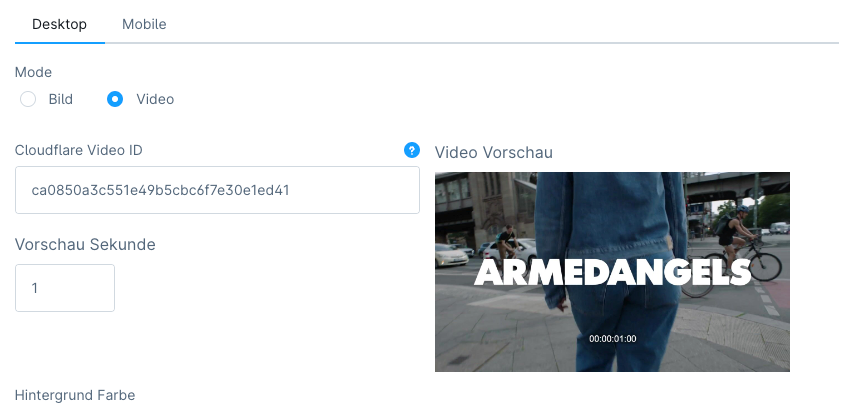
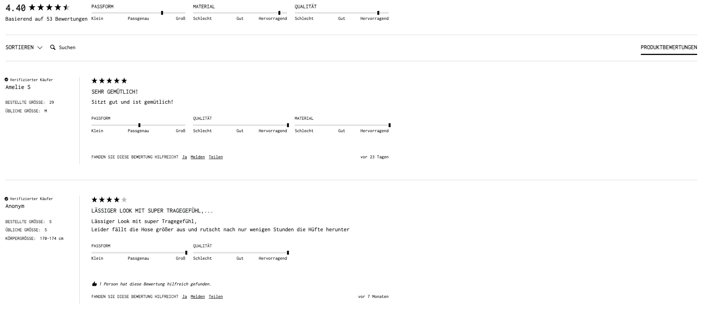

## [Projects](/portfolio/) | Armedangels ([Link](https://www.armedangels.com/de-de){:target="_blank"})

#### Table of Contents:
- [Accomplishments](#accomplishments)
- [Gallery](#gallery)

**Project description:** ARMEDANGELS is a pioneer of slow fashion and, at the same time, a true trailblazer in the e-commerce sector. The Cologne-based fashion label relies on sustainable and regenerative materials and designs that are as timeless as possible so as not to have to follow every new trend. They have been selling this fashion primarily through their online shop for 12 years, generating total sales of around 40 million euros annually. Today, their fair fashion products can be purchased in over 1,000 stores in Europe, but the Cologne-based company started out as a purely online company with just one sales channel – an online shop, through which they still generate a large portion of their sales today, only with a much more sophisticated shopping experience and convenience.

**Tech Stack**: Shopware 6, Vue, Twig, Javascript

### Accomplishments:
- optimized image performance by refactoring shopware's default srcset/sizes logic (autocalculation, smarter block sizes), adopting modern image formats like WEBP and AVIF, adding lazyloading and fetchpriority, improving slider initialisation
- optimized video performance by switching from local videos to cloudflare video streams, developed custom admin page builder blocks with previews, etc
- integrated Cloudflare Turnstile for enhanced security and spam protection
- improved loading of reviews.io sections by refactoring js
- helped to identify ecommerce order tracking bug with Sentry

### Gallery

*Listing*

*Product*

*Video page builder block*

*Reviews*