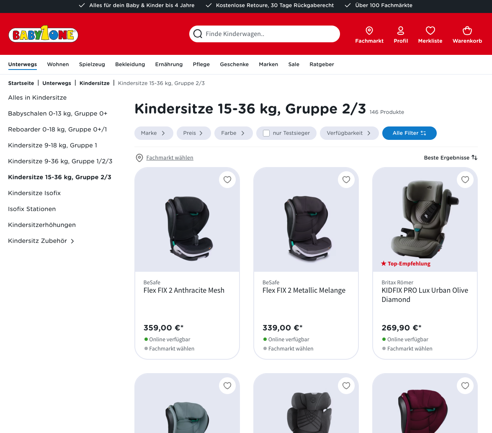
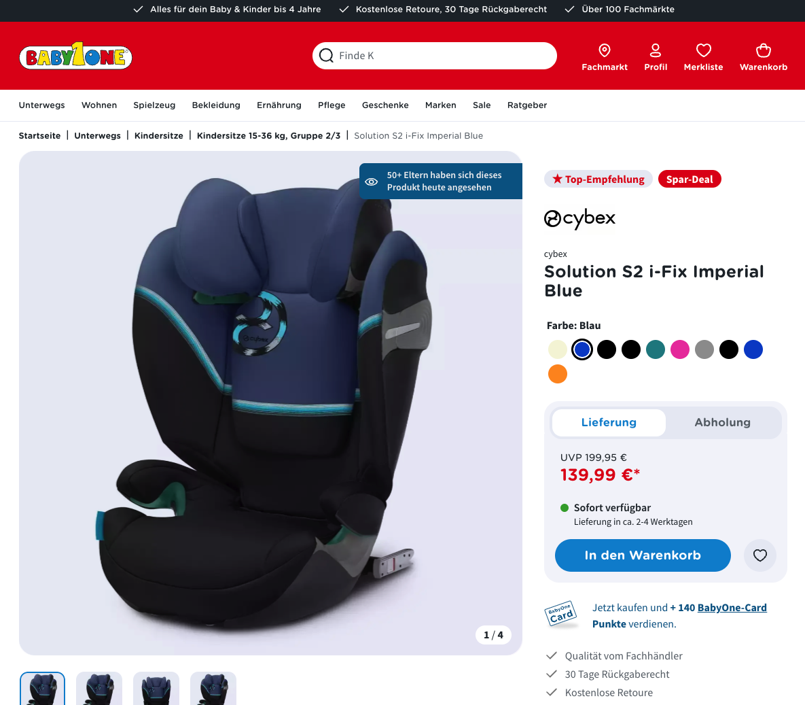
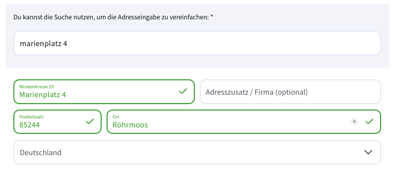
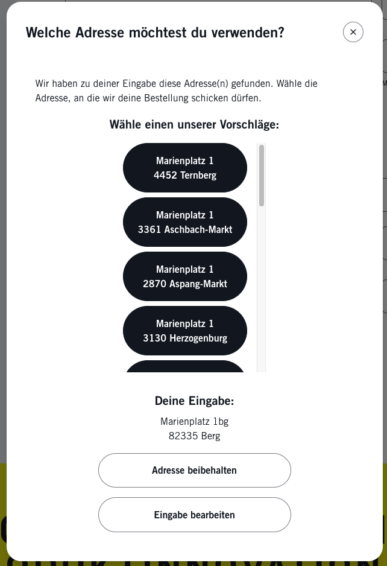

## [Projects](/portfolio/) | Babyone ([Link](https://www.babyone.de/))

#### Table of Contents:
- [Highlights](#highlights)
- [Accomplishments](#accomplishments)
- [Gallery](#gallery)

**Project description:** BabyOne has been the leading omnichannel provider of baby and toddler products in the franchise system in the DACH region for over 35 years. We offer expectant and young families a wide range of products from our own and third-party brands, as well as customized service offerings – on-site, in one of our 28 own stores or 76 franchise stores, and digitally via our online shop. BabyOne is a second-generation, owner-managed family business run by Dr. Anna Weber and Dr. Jan-Willem Weischer. The company employs over 1,400 people at its headquarters, its own stores, and its franchise stores. BabyOne Franchise- und Systemzentrale GmbH is based in Münster.

**Tech Stack**: Shopware 6, Vue, Twig, Javascript

### Highlights
- highly customized shop
- Babyone Card integration (internal loyalty program)
- Address Validation with Loqate
- custom item reservation logic
- store locator

### Accomplishments:
- refactored checkout logic
- refactored form validation logic
- integrated address validation (Loqate)
- integrated emarsys web extend tracking (inkl admin component with config)

### Gallery

*Listing*

*Detail*

*Address states*

*Address modal*