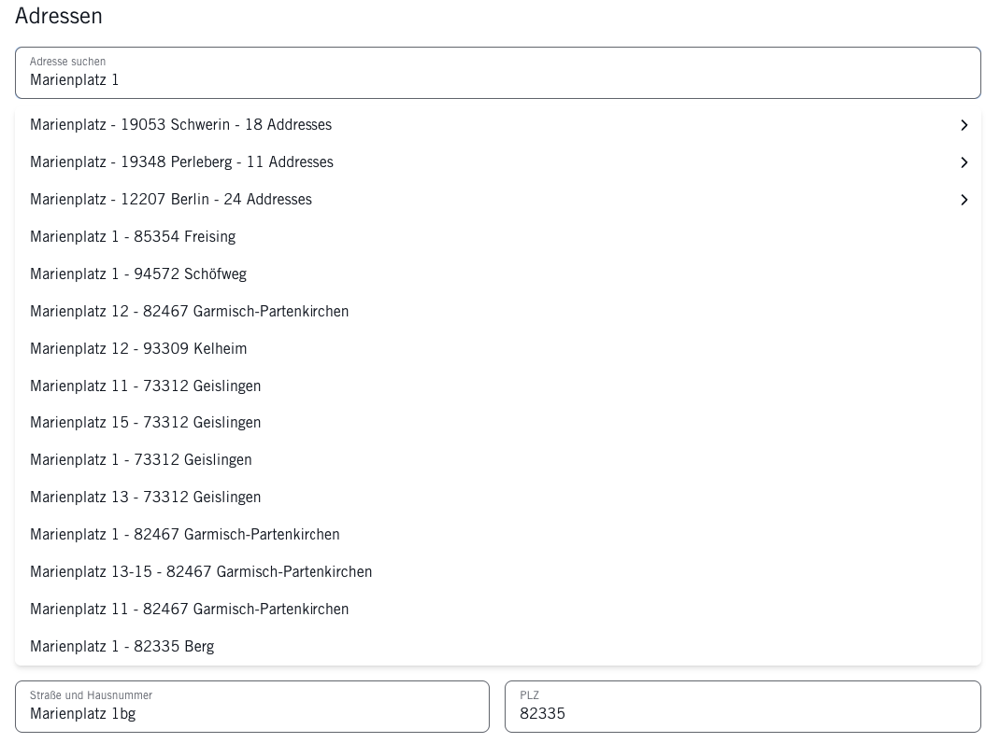
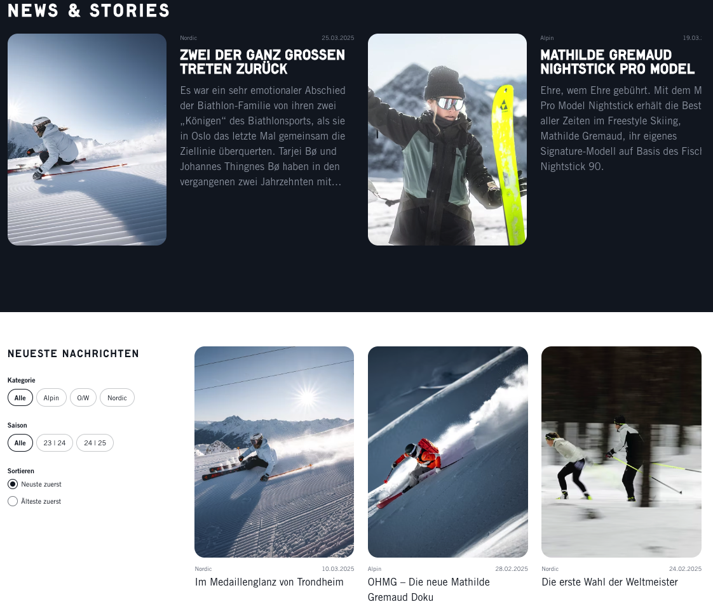
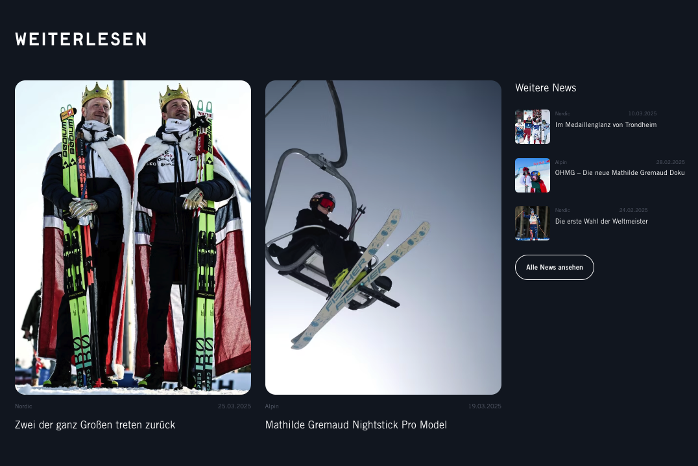

## [Projects](/portfolio/) | Fishersports ([Link](https://www.fischersports.com/de_de){:target="_blank"})

#### Table of Contents:
- [Accomplishments](#accomplishments)
- [Gallery](#gallery)

**Project description:** Fishersports is market leader in Nordic and Alpine top-level sports and one of the largest ski manufacturers worldwide.

**Tech Stack**: Vue 3, Nuxt, Typescript, Headless, SSR, Tailwind

### Accomplishments:
- integrated Loqate Address Validation: Nuxt server API routes, Loqate API, custom composables, component and other logic adjustements
- Developed Blog Feature: listing composable, filters, sorting, pagination (infinity scrolling), page builder blog components, etc

### Gallery

*Address suggests*

*Address correction modal*

*Blog Listing*

*Blog keep reading section*

