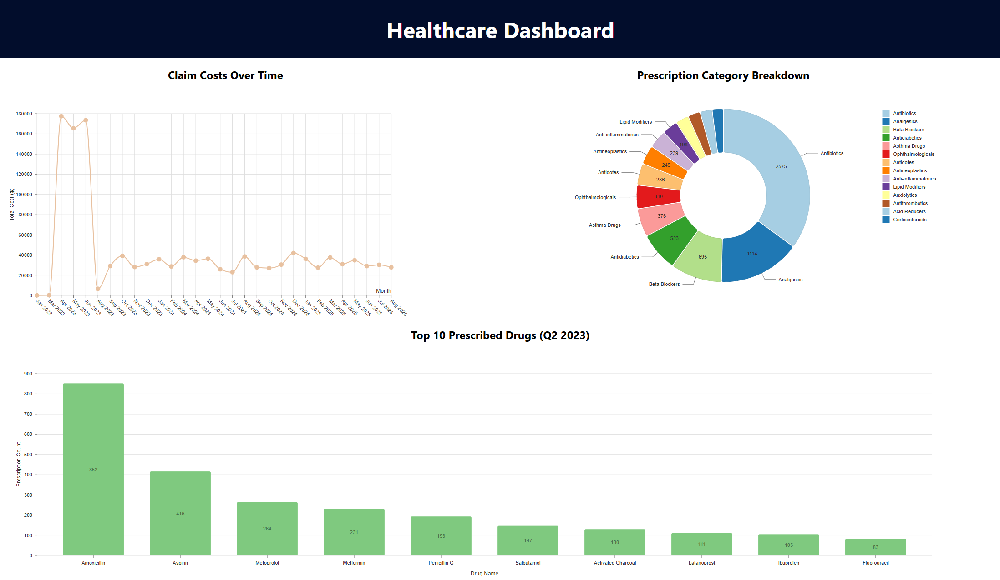
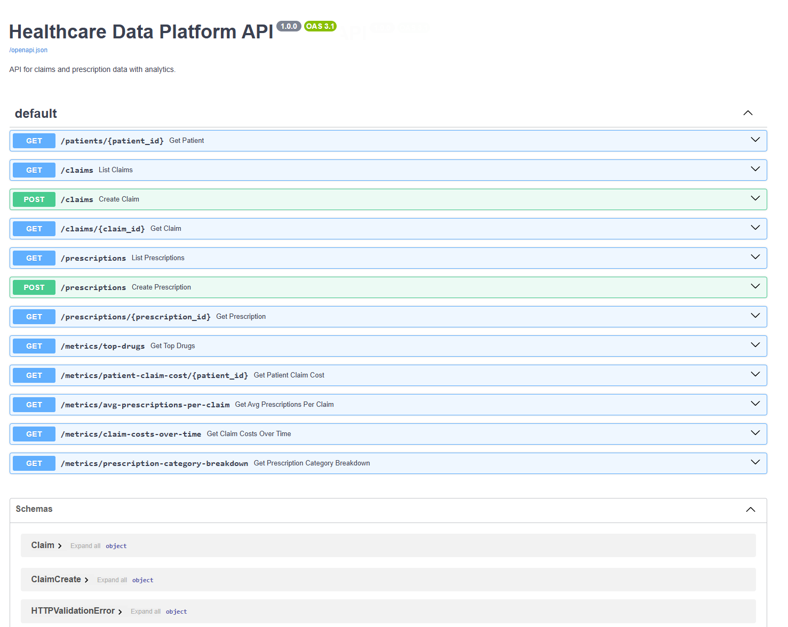

## [Projects](/portfolio/) | HealthcareTA ([Github](https://github.com/innpyt/healthcare-ta/){:target="_blank"})

**Project description:** This project was a solution for the technical case for the Senior Software Engineer position. It is a basic healthcare data platform focused on claims and prescription data, with a relational database, RESTful APIs, and a minimal analytics dashboard.

**Tech Stack**: Python FastAPI, PostgresSQL, React, Docker

### Highlights
- easy dockerised setup
- FastAPI routes with OpenAPI Documentation
- PostresSQL with schema, programmatically generated demo data, and db viewer
- basic data visualisations using [Nivo](https://nivo.rocks/){:target="_blank"})

### Gallery

