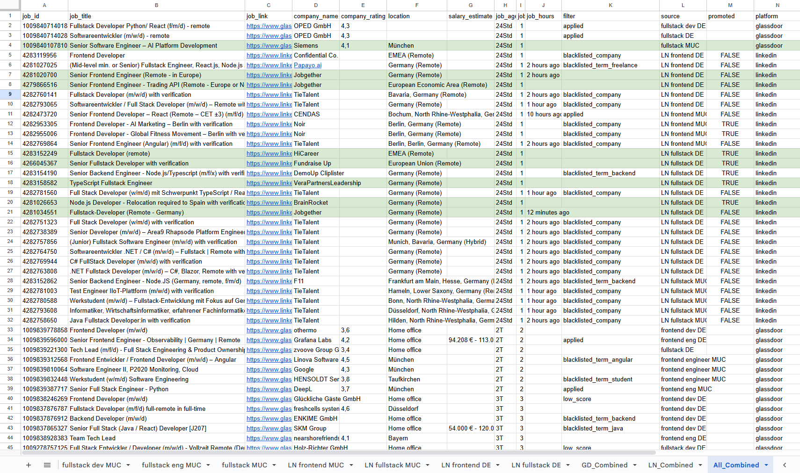

## [Projects](/portfolio/) | JobScraper

**Project description:** Personal python automation app from July 2025 which I built to automate my daily routine of checking new job applications on different job boards.

**Why?** 
Default search/filters on Linkedin/Glassdoor suck.
You always get some **unrelevant results** like 'DevOps Engineer' for 'Frontend Developer' search, need to use **multiple listings** like 'Fullstack Developer' vs 'Fullstack Engineer' manually checking **duplicates**, **cant filter** out unwanted companies or terms.

**Tech Stack**: Python, Selenium Webdriver, Pandas, Gspread

## Highlights
- Linkedin & Glassdoor support
- parallel scraping of multiple job board feed urls
- company and searchterm blacklisting
- already applied filtering
- export to Google Sheet or CSV (in an aggregated all-in-one or per feed format)
- sorting and deduplication (Pandas)
- autohighlight new jobs without filters
- persist job status/comment from prev scrape