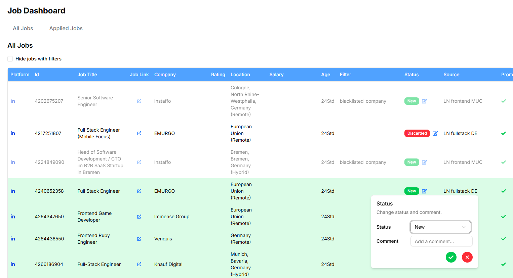

## [Projects](/portfolio/) | JobTracker

**Project description:** Personal job dashboard app from July 2025 which I built to automate my daily routine of checking new job applications on different job boards.

**Why?** 
Remember **[JobTracker](/portfolio/projects/jobtracker)** ?
Google Sheet or CSV are good but sometimes not flexible enough, e.g you can't hide filtered jobs with single click or persist the jobs from previous scrapes. Might even face Google Sheet API limits if you update too often or write too much.

**Tech Stack**: Python, Flask, React, shadcn, sqlite

## Highlights
- sqlite db to store the jobs
- Flask Backend API to retrieve and update jobs
- React Router for routing
- Tailwind & Schadcn (UI Component library)