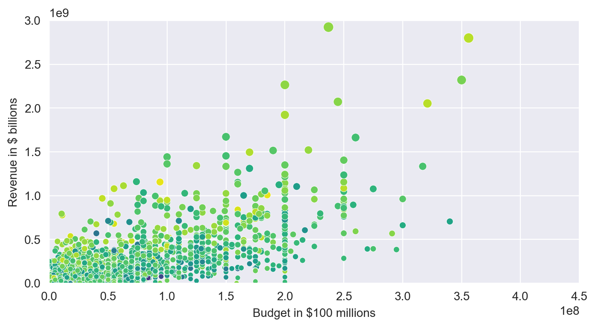
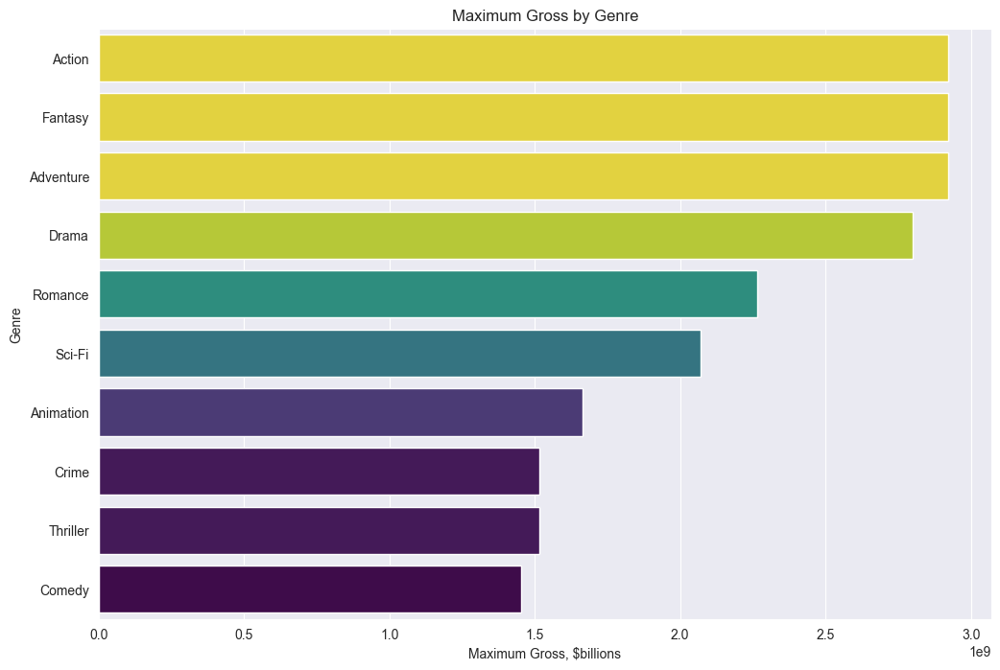
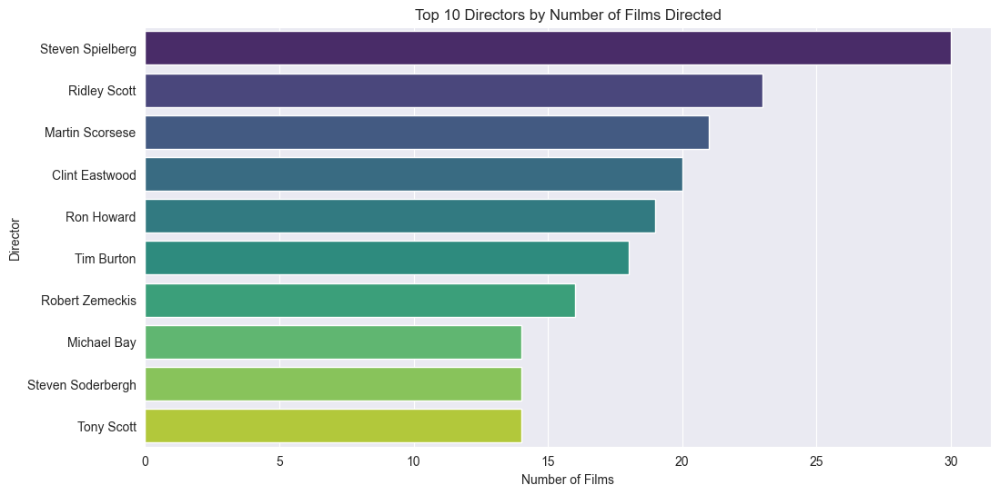

## [Projects](/portfolio/) | MovieData



**Project description:** Personal python data analytics notebook from August 2025

**Tech Stack**: Python, Pandas, Matplotlib, Seaborn, Sklearn

#### Table of Contents:
- [Descriptive Statistics](#descriptive-statistics)
- [Most common genres](#most-common-genres)
- [Genre with the most gross](#genre-with-the-most-gross)
- [Directors with most films](#directors-with-most-films)
- [Directors with max gross](#directors-with-max-gross)
- [Movie Releases over Time](#movie-releases-over-time)
- [Budget vs Revenue (Seaborn Bubble Charts)](#budget-vs-revenue-seaborn-bubble-charts)
- [Seaborn Regression Plots](#seaborn-regression-plots)
- [Own Regression](#own-regression-with-scikit-learn)
- [Model Prediction](#model-prediction)


# Introduction

Do higher film budgets lead to more box office revenue? Let's find out if there's a relationship using IMDB 2023 Dataset from [Kaggle](https://www.kaggle.com/datasets/adriankiezun/imdb-dataset-2023?resource=download).

# Import Statements


```python
import pandas as pd
import matplotlib.pyplot as plt

import seaborn as sns
from sklearn.linear_model import LinearRegression
```

# Notebook Presentation


```python
pd.options.display.float_format = '{:,.0f}'.format
pd.set_option('display.width', 400)
pd.set_option('display.max_columns', 10)
```

# Read the Data


```python
df = pd.read_csv('imdb_data.csv')
```

# Explore and Clean the Data


```python
#df.shape
#df.head()
#df.tail()
df.info()
df.sample(5)

```

    <class 'pandas.core.frame.DataFrame'>
    RangeIndex: 3348 entries, 0 to 3347
    Data columns (total 12 columns):
     #   Column          Non-Null Count  Dtype  
    ---  ------          --------------  -----  
     0   id              3348 non-null   object 
     1   primaryTitle    3348 non-null   object 
     2   originalTitle   3348 non-null   object 
     3   isAdult         3348 non-null   int64  
     4   runtimeMinutes  3348 non-null   int64  
     5   genres          3348 non-null   object 
     6   averageRating   3348 non-null   float64
     7   numVotes        3348 non-null   int64  
     8   budget          3348 non-null   int64  
     9   gross           3297 non-null   float64
     10  release_date    3343 non-null   object 
     11  directors       3348 non-null   object 
    dtypes: float64(2), int64(4), object(6)
    memory usage: 314.0+ KB
    


<div>
<style scoped>
    .dataframe tbody tr th:only-of-type {
        vertical-align: middle;
    }

    .dataframe tbody tr th {
        vertical-align: top;
    }

    .dataframe thead th {
        text-align: right;
    }
</style>
<table border="1" class="dataframe">
  <thead>
    <tr style="text-align: right;">
      <th></th>
      <th>id</th>
      <th>primaryTitle</th>
      <th>originalTitle</th>
      <th>isAdult</th>
      <th>runtimeMinutes</th>
      <th>...</th>
      <th>numVotes</th>
      <th>budget</th>
      <th>gross</th>
      <th>release_date</th>
      <th>directors</th>
    </tr>
  </thead>
  <tbody>
    <tr>
      <th>833</th>
      <td>tt0134273</td>
      <td>8MM</td>
      <td>8MM</td>
      <td>0</td>
      <td>123</td>
      <td>...</td>
      <td>139984</td>
      <td>40000000</td>
      <td>96,618,699</td>
      <td>February 19, 1999</td>
      <td>Joel Schumacher</td>
    </tr>
    <tr>
      <th>1641</th>
      <td>tt0454841</td>
      <td>The Hills Have Eyes</td>
      <td>The Hills Have Eyes</td>
      <td>0</td>
      <td>107</td>
      <td>...</td>
      <td>180399</td>
      <td>15000000</td>
      <td>70,009,308</td>
      <td>March 10, 2006</td>
      <td>Alexandre Aja</td>
    </tr>
    <tr>
      <th>2620</th>
      <td>tt1821694</td>
      <td>RED 2</td>
      <td>RED 2</td>
      <td>0</td>
      <td>116</td>
      <td>...</td>
      <td>178197</td>
      <td>84000000</td>
      <td>148,075,565</td>
      <td>July 18, 2013</td>
      <td>Dean Parisot</td>
    </tr>
    <tr>
      <th>1161</th>
      <td>tt0294870</td>
      <td>Rent</td>
      <td>Rent</td>
      <td>0</td>
      <td>135</td>
      <td>...</td>
      <td>55315</td>
      <td>40000000</td>
      <td>31,670,620</td>
      <td>November 23, 2005</td>
      <td>Chris Columbus</td>
    </tr>
    <tr>
      <th>1332</th>
      <td>tt0362120</td>
      <td>Scary Movie 4</td>
      <td>Scary Movie 4</td>
      <td>0</td>
      <td>83</td>
      <td>...</td>
      <td>127234</td>
      <td>45000000</td>
      <td>178,262,620</td>
      <td>April 12, 2006</td>
      <td>David Zucker</td>
    </tr>
  </tbody>
</table>
<p>5 rows × 12 columns</p>
</div>


### Cleanup and conversions

- convert 'September 18, 2019' dates to datetime
- convert averageRating to numeric
- delete column isAdult as we wont need it
- drop empty gross
- fix singlevalue


```python
df.drop(columns=['isAdult'], inplace=True) # not used
df.dropna(inplace=True) # 51 films have falsely 0 gross

df['release_date'] = pd.to_datetime(df['release_date'], format='mixed')
#df['averageRating'] = pd.to_numeric(df['averageRating'], errors='coerce').astype('float64')
df.loc[df.budget == 18, 'budget'] = 18000000 # fix single value

df['gross'] = pd.to_numeric(df['gross'], errors='coerce')

df.head(5)
```


<div>
<style scoped>
    .dataframe tbody tr th:only-of-type {
        vertical-align: middle;
    }

    .dataframe tbody tr th {
        vertical-align: top;
    }

    .dataframe thead th {
        text-align: right;
    }
</style>
<table border="1" class="dataframe">
  <thead>
    <tr style="text-align: right;">
      <th></th>
      <th>id</th>
      <th>primaryTitle</th>
      <th>originalTitle</th>
      <th>runtimeMinutes</th>
      <th>genres</th>
      <th>...</th>
      <th>numVotes</th>
      <th>budget</th>
      <th>gross</th>
      <th>release_date</th>
      <th>directors</th>
    </tr>
  </thead>
  <tbody>
    <tr>
      <th>0</th>
      <td>tt0035423</td>
      <td>Kate &amp; Leopold</td>
      <td>Kate &amp; Leopold</td>
      <td>118</td>
      <td>Comedy,Fantasy,Romance</td>
      <td>...</td>
      <td>87925</td>
      <td>48000000</td>
      <td>76,019,048</td>
      <td>2001-12-11</td>
      <td>James Mangold</td>
    </tr>
    <tr>
      <th>1</th>
      <td>tt0065421</td>
      <td>The Aristocats</td>
      <td>The AristoCats</td>
      <td>78</td>
      <td>Adventure,Animation,Comedy</td>
      <td>...</td>
      <td>111758</td>
      <td>4000000</td>
      <td>35,459,543</td>
      <td>1970-12-11</td>
      <td>Wolfgang Reitherman</td>
    </tr>
    <tr>
      <th>2</th>
      <td>tt0065938</td>
      <td>Kelly's Heroes</td>
      <td>Kelly's Heroes</td>
      <td>144</td>
      <td>Adventure,Comedy,War</td>
      <td>...</td>
      <td>52628</td>
      <td>4000000</td>
      <td>5,200,000</td>
      <td>1970-01-01</td>
      <td>Brian G. Hutton</td>
    </tr>
    <tr>
      <th>3</th>
      <td>tt0066026</td>
      <td>M*A*S*H</td>
      <td>M*A*S*H</td>
      <td>116</td>
      <td>Comedy,Drama,War</td>
      <td>...</td>
      <td>75784</td>
      <td>3500000</td>
      <td>81,600,000</td>
      <td>1970-01-25</td>
      <td>Robert Altman</td>
    </tr>
    <tr>
      <th>4</th>
      <td>tt0066206</td>
      <td>Patton</td>
      <td>Patton</td>
      <td>172</td>
      <td>Biography,Drama,War</td>
      <td>...</td>
      <td>106476</td>
      <td>12000000</td>
      <td>61,749,765</td>
      <td>1970-02-04</td>
      <td>Franklin J. Schaffner</td>
    </tr>
  </tbody>
</table>
<p>5 rows × 11 columns</p>
</div>


### Descriptive Statistics


```python
df.describe()
```


<div>
<style scoped>
    .dataframe tbody tr th:only-of-type {
        vertical-align: middle;
    }

    .dataframe tbody tr th {
        vertical-align: top;
    }

    .dataframe thead th {
        text-align: right;
    }
</style>
<table border="1" class="dataframe">
  <thead>
    <tr style="text-align: right;">
      <th></th>
      <th>runtimeMinutes</th>
      <th>averageRating</th>
      <th>numVotes</th>
      <th>budget</th>
      <th>gross</th>
      <th>release_date</th>
    </tr>
  </thead>
  <tbody>
    <tr>
      <th>count</th>
      <td>3,292</td>
      <td>3,292</td>
      <td>3,292</td>
      <td>3,292</td>
      <td>3,292</td>
      <td>3292</td>
    </tr>
    <tr>
      <th>mean</th>
      <td>113</td>
      <td>7</td>
      <td>217,090</td>
      <td>50,468,636</td>
      <td>168,264,559</td>
      <td>2005-11-07 19:06:03.061968512</td>
    </tr>
    <tr>
      <th>min</th>
      <td>63</td>
      <td>1</td>
      <td>50,004</td>
      <td>6,000</td>
      <td>210</td>
      <td>1970-01-01 00:00:00</td>
    </tr>
    <tr>
      <th>25%</th>
      <td>98</td>
      <td>6</td>
      <td>79,396</td>
      <td>15,000,000</td>
      <td>36,283,303</td>
      <td>1999-07-19 12:00:00</td>
    </tr>
    <tr>
      <th>50%</th>
      <td>109</td>
      <td>7</td>
      <td>129,715</td>
      <td>32,000,000</td>
      <td>88,434,290</td>
      <td>2007-09-29 00:00:00</td>
    </tr>
    <tr>
      <th>75%</th>
      <td>124</td>
      <td>7</td>
      <td>249,003</td>
      <td>68,000,000</td>
      <td>200,995,146</td>
      <td>2014-01-20 00:00:00</td>
    </tr>
    <tr>
      <th>max</th>
      <td>229</td>
      <td>9</td>
      <td>2,817,283</td>
      <td>356,000,000</td>
      <td>2,923,706,026</td>
      <td>2023-10-25 00:00:00</td>
    </tr>
    <tr>
      <th>std</th>
      <td>20</td>
      <td>1</td>
      <td>249,472</td>
      <td>51,786,917</td>
      <td>236,752,803</td>
      <td>NaN</td>
    </tr>
  </tbody>
</table>
</div>


- the average film costs about $50m to make and earns more than 3x (or $168m) in worldwide revenue.
- 25% are also profitable but only at around 2x budget rate.
- The lowest budget was $6,000 with the revenue of $126,052
- The highest production budget was $356,000,000 with highest worldwide revenue $2,923,706,026 or (8x the budget)!

I believe it should be **Avatar** by James Cameron, but lets check it out and also see the one with the lowest budget.


```python
df[df.budget.isin([6000, 356000000])]
```


<div>
<style scoped>
    .dataframe tbody tr th:only-of-type {
        vertical-align: middle;
    }

    .dataframe tbody tr th {
        vertical-align: top;
    }

    .dataframe thead th {
        text-align: right;
    }
</style>
<table border="1" class="dataframe">
  <thead>
    <tr style="text-align: right;">
      <th></th>
      <th>id</th>
      <th>primaryTitle</th>
      <th>originalTitle</th>
      <th>runtimeMinutes</th>
      <th>genres</th>
      <th>...</th>
      <th>numVotes</th>
      <th>budget</th>
      <th>gross</th>
      <th>release_date</th>
      <th>directors</th>
    </tr>
  </thead>
  <tbody>
    <tr>
      <th>878</th>
      <td>tt0154506</td>
      <td>Following</td>
      <td>Following</td>
      <td>69</td>
      <td>Crime,Mystery,Thriller</td>
      <td>...</td>
      <td>99219</td>
      <td>6000</td>
      <td>126,052</td>
      <td>1998-04-24</td>
      <td>Christopher Nolan</td>
    </tr>
    <tr>
      <th>3055</th>
      <td>tt4154796</td>
      <td>Avengers: Endgame</td>
      <td>Avengers: Endgame</td>
      <td>181</td>
      <td>Action,Adventure,Drama</td>
      <td>...</td>
      <td>1224453</td>
      <td>356000000</td>
      <td>2,799,439,100</td>
      <td>2019-04-18</td>
      <td>Anthony Russo, Joe Russo</td>
    </tr>
  </tbody>
</table>
<p>2 rows × 11 columns</p>
</div>


Surprise, it's now actually **Avengers: Endgame**!
And the lowest budget is **Following** by Christopher Nolan, released in 1998... Never heard of it, but ok. Interesting is that it also made x21 the budget.

### Films that Lost Money

Of course not all films are successfull, lets find out what is the percentage of films where the production costs exceeded the worldwide gross revenue? 


```python
money_losing = df.loc[df.budget > df.gross]
print(len(money_losing)/len(df))

```

    0.14975698663426487
    

14.9% of films do not recoup their budget at the worldwide box office. Seems quite low but this dataset doesn't include domestic revenue, so films that were never released worldwide are not even included.

# Most common genres


```python
genres = df['genres'].str.get_dummies(sep = ',')
plt.figure(figsize = (9,9))
plt.pie(genres.sum().sort_values(ascending = False),
        labels = genres.sum().sort_values(ascending = False).index,
        autopct='%1.1f%%',
        colors = sns.color_palette("Paired"))

plt.title('Most common genres', fontweight = 'bold')

plt.tight_layout()
plt.show()
```


    

    


# Genre with the most gross


```python
df['genres'] = df['genres'].str.split(',')
df_exploded = df.explode('genres')
genre_gross = df_exploded.groupby('genres')['gross'].max().sort_values(ascending=False).head(10)

genre_names = genre_gross.index
max_gross = genre_gross.values

plt.figure(figsize=(12, 8))
sns.barplot(x=max_gross, y=genre_names, hue=max_gross, palette="viridis", legend=False, orient='h')
plt.ylabel('Genre')
plt.xlabel('Maximum Gross, $billions')
plt.title('Maximum Gross by Genre')
plt.show()
```

    genres
    Action      2,923,706,026
    Fantasy     2,923,706,026
    Adventure   2,923,706,026
    Drama       2,799,439,100
    Romance     2,264,743,305
    Sci-Fi      2,071,310,218
    Animation   1,663,075,401
    Crime       1,515,341,399
    Thriller    1,515,341,399
    Comedy      1,453,683,476
    Name: gross, dtype: float64
    


    

    


Most common genres: Adventure, Action, Drama also have max gross values. Interesting that Comedy gets replaced by Fantasy, which is only about 3.7%

# Directors with most films


```python
top_directors = df["directors"].value_counts().head(10)

plt.figure(figsize=(12, 6))
sns.barplot(x=top_directors.values, y=top_directors.index, hue=top_directors.index, palette="viridis", legend=False, orient='h')
plt.title('Top 10 Directors by Number of Films Directed')
plt.xlabel('Number of Films')
plt.ylabel('Director')
plt.show()

```


    

    


# Directors with max gross


```python
dir_gross=df.groupby('directors')['gross'].max().sort_values(ascending=False).head(10)

director_names = dir_gross.index
max_gross = dir_gross.values

plt.figure(figsize=(10, 6))
sns.barplot(x=max_gross, y=director_names, hue=director_names, palette="viridis", legend=False, orient='h')
plt.ylabel('Directors')
plt.xlabel('Maximum Gross')
plt.title('Maximum Gross by Director (Top 10)')
plt.xticks(rotation=45, ha='right')
plt.show()
```


    

    


# Budget vs Revenue (Seaborn Bubble Charts)


```python
plt.figure(figsize=(8,4), dpi=200)
with sns.axes_style('darkgrid'):
    ax = sns.scatterplot(data=df,
                         x='budget',
                         y='gross',
                         hue=('averageRating'),
                         palette="viridis",
                         legend=False,
                         size=('gross'))

    ax.set(ylim=(0, 3000000000),
           xlim=(0, 450000000),
           ylabel='Revenue in $ billions',
           xlabel='Budget in $100 millions')

plt.show()
```


    

    


Bigger budget seems to correspond to higher revenue. And also budgets above $100m tend to stick to fix sums like 150, 200

## Movie Releases over Time


```python
plt.figure(figsize=(8,4), dpi=200)
with sns.axes_style('darkgrid'):
    ax = sns.scatterplot(data=df,
                         x='release_date',
                         y='gross',
                         hue=('averageRating'),
                         legend=True,
                         palette="viridis",
                         size=('gross'))

    ax.set(ylim=(0, 3000000000),
           xlim=(df.release_date.min(), df.release_date.max()),
           ylabel='Revenue in $ billions',
           xlabel='Budget in $100 millions')

plt.show()
```


    

    


We clearly see a positive trend of budgets/revenue increasing over time

# Seaborn Regression Plots


```python
plt.figure(figsize=(8,4), dpi=200)
with sns.axes_style('darkgrid'):
  ax = sns.regplot(data=df,
                   x='budget',
                   y='gross',
                   color='#2f4b7c',
                   scatter_kws = {'alpha': 0.3},
                   line_kws = {'color': '#ff7c43'})

  ax.set(ylim=(0, 3000000000),
         xlim=(0, 450000000),
         ylabel='Revenue in $ billions',
         xlabel='Budget in $100 millions')
```


    

    


We also see that a film with a $150 million budget is predicted to make slightly under $500 million by our regression line.
All in all, we can be pretty confident that there does indeed seem to be a relationship between a film's budget and that film's worldwide revenue.

# Own Regression with scikit-learn
$ REVENUE = \theta _0 + \theta _1 * BUDGET$


```python
regression = LinearRegression()
# Explanatory Variable or Feature
X = pd.DataFrame(df, columns=['budget'])

# Response Variable or Target
y = pd.DataFrame(df, columns=['gross'])
regression.fit(X, y)

# R-squared
regression.score(X, y)
theta0 = regression.intercept_[0] # y-intercept
theta1 = regression.coef_[0] # slope
r2 = regression.score(X,y) # r-squared

print(f"Y-Intercept (theta0) is {theta0}")
print(f"Slope coefficient(theta1) is {theta1}")
print(f"R-squared is {r2}")
```

    Y-Intercept (theta0) is 7157763.965588003
    Slope coefficient(theta1) is [3.19221611]
    R-squared is 0.48756712843206695
    

- Y-intercept (theta0) tells us the estimated revenue for a given budget
- Slope (theta1) tells us that for every extra $1 in the budget, movie revenue increases by $3.19
- R-squared 0.48 means that our model explains about 48% of the variance in movie revenue.
That's actually pretty decent, considering we've got the simplest possible model, with only one explanatory variable.

# Model Prediction

We just estimated the slope and intercept! Remember that our Linear Model has the following form:

$ REV \hat ENUE = \theta _0 + \theta _1 BUDGET$


```python
budget = 350000000
revenue_estimate = theta0 + regression.coef_[0,0] * budget
revenue_estimate = round(revenue_estimate, -6)
print(f'The estimated revenue for a $350m film is around ${revenue_estimate:.10}.')
```

    The estimated revenue for a $350m film is around $1.124e+09.
    

So for a $350M we estimate $1.12B

# That's it, thanks for watching!
