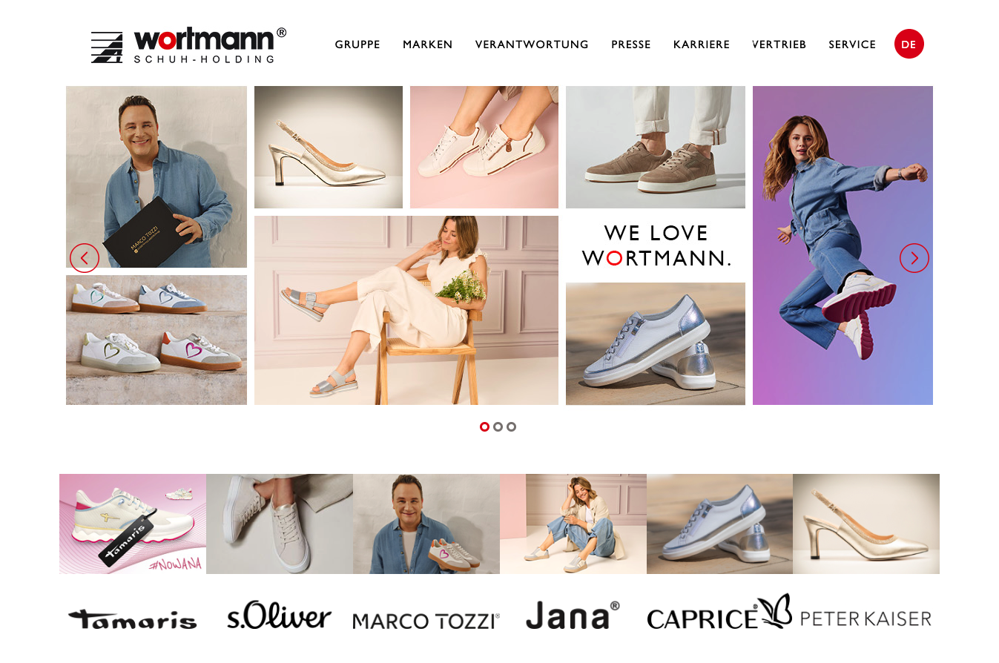

## [Projects](/portfolio/) | Wortmann ([Link](https://wortmann-group.com/de/home){:target="_blank"})

#### Table of Contents:
- [Highlights](#highlights)
- [Accomplishments](#accomplishments)
- [Gallery](#gallery)

**Project description:** The Wortmann Group, based in Detmold, Germany, is best known for its Tamaris brand and is one of the largest shoe manufacturing and distribution companies in Europe and is considered the market leader for fashionable women's shoes. Its collections are available in over 70 countries and more than 15,000 shoe stores worldwide. In addition to the top brand Tamaris, the group also includes the brands Marco Tozzi, Caprice, Jana, and s.Oliver shoes.

**Tech Stack**: Shopware 6, PWA, Vue, Twig, Typescript, Javascript, 

### Highlights
- Shopware PWA Storefront
- [Digital Sales Room](https://www.shopware.com/de/produkte/digital-sales-rooms/) (Interactive presentations and sales feature originally co-developed with Shopware that allows to do interactive presentations, Wortmann was one of the first beta-testers)
- highly configurable Order Matrix

### Accomplishments:
- integrated Barcode Scanner into digital sales room PWA

### Gallery

*Digital Sales Room ([Video](https://videos.ctfassets.net/nqzs8zsepqpi/1MlPZAN46uCbQBNJ45nd7M/0cb0d2d763df51646f47f8345dc2c494/Digital-Sales-Rooms_Usecase-1_Guided_DE-animations_1920x1080_no-audio_v3.mp4){:target="_blank"})*

*Barcode scanner*
